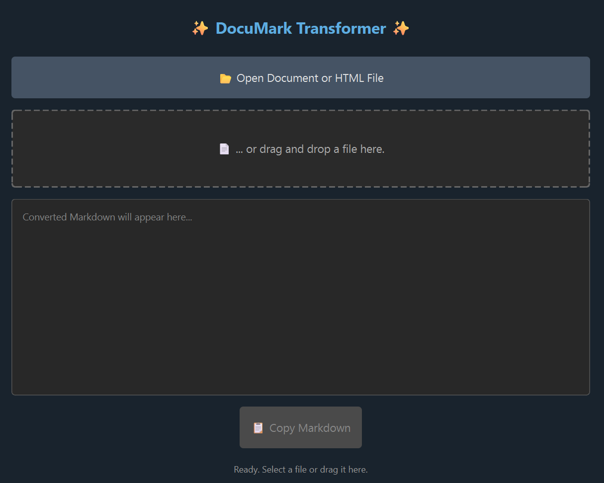

# ✨ DocuMark Transformer ✨

**(Formerly Docling Python GUI)**

[](https://www.python.org/downloads/)
[](https://doc.qt.io/qtforpython/)
[](https://github.com/ColinDuquesnoy/QDarkStyleSheet)
[](https://github.com/docling-ai/langchain-docling)

A simple and stylish desktop GUI application built with Python and PySide6 to convert various document formats (.pdf, .docx, .pptx, .html) into Markdown using the power of [`langchain-docling`](https://github.com/docling-ai/langchain-docling).

---

## 📸 Screenshot


---

## 🚀 Features

* 📄 **Convert Multiple Formats:** Supports `.pdf`, `.docx`, `.pptx`, `.html`, and `.htm` files.
* 🖱️ **Easy Input:** Open files using the standard file dialog or simply drag and drop them onto the application window.
* M↓ **Markdown Output:** View the converted Markdown content directly within the application's text area.
* 📋 **Copy to Clipboard:** Easily copy the generated Markdown with a single button click.
* 🎨 **Dark Theme:** Features a pleasant dark user interface powered by QDarkStyle.
* ⏳ **Status Updates:** Provides feedback on the conversion process (Ready, Converting, Success, Error).
* 🛠️ **Platform Workarounds:** Includes built-in attempts to handle common issues like:
    * Hugging Face Hub symlink errors on Windows (`OSError [WinError 1314]`).
    * Drag-and-drop path resolution on newer macOS versions.
* ❗ **Error Handling:** Displays informative error messages for issues like file not found, permission errors, missing dependencies, or conversion failures.

---

## 📂 Supported Input Formats

* PDF Files (`.pdf`)
* Word Documents (`.docx`)
* PowerPoint Presentations (`.pptx`)
* HTML Files (`.html`, `.htm`)

---

## 📋 Requirements

* **Python:** Version 3.8 or higher is recommended.
* **pip:** Python package installer (usually comes with Python).
* **Operating System:** Windows, macOS, or Linux (Tested primarily with Windows/macOS considerations in mind).

---

## ⚙️ Installation & Setup

1.  **Clone or Download:**
    * Clone the repository:
        ```bash
        git clone <your-repository-url>
        cd <your-repository-directory>
        ```
    * Or download the source code ZIP and extract it.

2.  **Create a Virtual Environment (Recommended):**
    ```bash
    python -m venv venv
    # On Windows
    .\venv\Scripts\activate
    # On macOS/Linux
    source venv/bin/activate
    ```

3.  **Install Dependencies:**
    The application relies on several Python packages. Install them using pip:
    ```bash
    pip install PySide6 qdarkstyle langchain-docling
    ```
    * **Note:** `langchain-docling` may download additional models (from Hugging Face Hub) and dependencies the first time it's used for a specific file type. This might take some time and requires an internet connection.
    * Depending on the specific document types you frequently convert and your environment, `langchain-docling` might suggest installing optional dependencies (e.g., `pip install langchain-docling[ocr]` for advanced PDF scanning). Check their documentation if you encounter issues with specific complex files.

---

## ▶️ Usage

1.  Make sure you have activated your virtual environment (if you created one).
2.  Navigate to the directory containing the script.
3.  Run the application from your terminal:

    ```bash
    python docling_gui.py
    ```

4.  Use the "📂 Open Document or HTML File" button or drag and drop a supported file onto the window.
5.  The converted Markdown will appear in the text area.
6.  Use the "📋 Copy Markdown" button to copy the result.

---

## Platform Notes

* **Windows:**
    * **Hugging Face Symlink Issue:** `langchain-docling` uses Hugging Face Hub for model management. On Windows, creating symbolic links (symlinks) often requires administrator privileges or enabling "Developer Mode". This can cause an `OSError: [WinError 1314] A required privilege is not held by the client` when models are downloaded/cached.
    * **Workaround:** This script *automatically* sets the environment variable `HF_HUB_DISABLE_SYMLINKS=1` before importing relevant libraries. This tells Hugging Face Hub to *copy* files instead of using symlinks, avoiding the privilege error. This might use slightly more disk space in the cache (`C:\Users\<YourUser>\.cache\huggingface`).
    * **If Errors Persist:** Although the script tries to prevent it, if you still see WinError 1314, try:
        * Enabling [Developer Mode](https://learn.microsoft.com/en-us/windows/apps/get-started/enable-your-device-for-development) in Windows Settings.
        * Running the script as an Administrator (right-click -> Run as administrator).
        * Checking permissions on your Hugging Face cache directory.

* **macOS:**
    * **Drag and Drop:** Newer macOS versions have stricter sandboxing for drag-and-drop operations. This script includes a workaround using the `Foundation` library (if available) to correctly resolve file paths dropped onto the application.

---

## 🔧 Troubleshooting

* **`ImportError: langchain-docling not found`:** Make sure you have installed the dependencies correctly using `pip install -r requirements.txt` (if you create one) or `pip install PySide6 qdarkstyle langchain-docling`. Ensure your virtual environment is active.
* **`ImportError: No module named 'some_dependency'`:** `langchain-docling` might require extra libraries for specific file types that weren't installed automatically. Check the `langchain-docling` documentation or the specific error message for clues (e.g., you might need `pip install pypdf` or `pip install python-docx`).
* **Conversion Fails / Empty Output:**
    * Ensure the input file is not corrupted or password-protected.
    * The document might be empty or have content `langchain-docling` cannot parse (e.g., image-only PDF without OCR capabilities installed/enabled).
    * Check the console for more detailed error messages printed by the script or underlying libraries.
* **`OSError` / Permission Denied:** Ensure the application has read permissions for the file you are trying to open and write permissions for the Hugging Face cache directory. Check if the file is open in another application.
* **Application Doesn't Start / `qdarkstyle` Error:** Ensure `qdarkstyle` and `PySide6` installed correctly. The application attempts to fall back to default styling if `qdarkstyle` fails to load.

---

## 📦 Core Dependencies

* **PySide6:** Qt for Python bindings (GUI framework).
* **qdarkstyle:** For the dark theme stylesheet.
* **langchain-docling:** Handles the core document loading and conversion to Markdown.
* **(Indirect) huggingface_hub:** Used by `langchain-docling` for model management.

---

## 📄 License

This project is currently unlicensed.

---